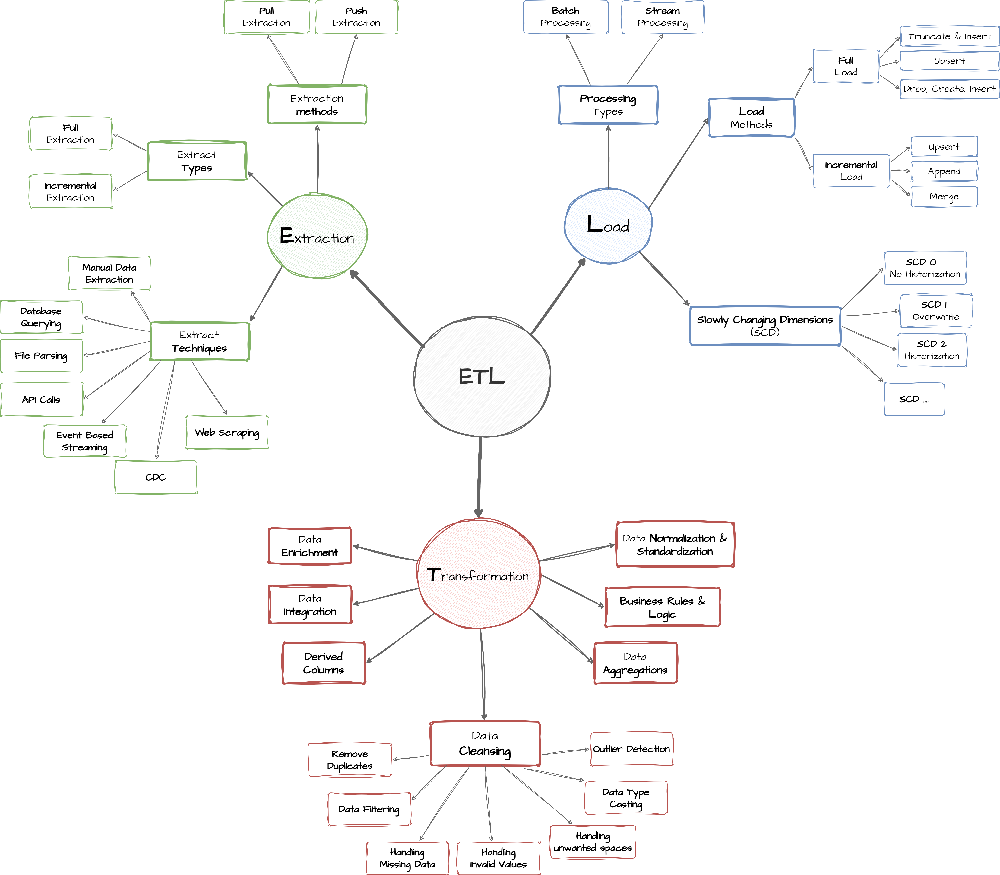

# SQL Data Warehouse Project

An end-to-end **SQL Server data warehouse** that integrates customer, product, and sales data from CRM and ERP source systems into an analytics-ready star schema.

The project demonstrates a complete data engineering workflow using T-SQL: source ingestion, data cleansing, standardization, integration, dimensional modeling, and data-quality validation.

<p align="center">
  
</p>

## Learning Context and Attribution

This repository was developed as a hands-on educational project by following the Udemy course [**Building a Modern Data Warehouse - Data Engineering Bootcamp**](https://www.udemy.com/course/building-a-modern-data-warehouse-data-engineering-bootcamp/), created by **Baraa Khatib Salkini**.

The project architecture, source datasets, Bronze-Silver-Gold workflow, and general implementation approach are based on the course project. The SQL scripts were executed, reviewed, documented, and adapted as part of my own learning process to strengthen my practical understanding of SQL Server, ETL pipelines, data cleansing, data integration, dimensional modeling, and data-quality validation.

This repository is intended for educational and portfolio purposes. Credit for the original course structure and learning materials belongs to the course instructor.

## Project Overview

The warehouse processes six CSV files from two operational source systems:

- **CRM:** customer information, product information, and sales transactions.
- **ERP:** customer demographics, customer locations, and product categories.

The solution follows a **Medallion Architecture** with three layers:

1. **Bronze Layer** — stores the source data in its original form.
2. **Silver Layer** — cleans, standardizes, validates, and enriches the data.
3. **Gold Layer** — integrates the data into business-ready dimensions and facts.

The final model is designed for reporting, ad-hoc SQL analysis, and future BI or machine-learning use cases.

## Project Objectives

- Build a structured data warehouse in Microsoft SQL Server.
- Consolidate CRM and ERP data into a single analytical model.
- Preserve raw source data for traceability and troubleshooting.
- Apply cleansing and business rules in a dedicated transformation layer.
- Create a star schema optimized for analytical queries.
- Validate data quality across the Silver and Gold layers.
- Document the architecture, lineage, integration rules, and data model.

## Technology Stack

- **Database:** Microsoft SQL Server
- **Language:** T-SQL
- **Source format:** CSV files
- **Data ingestion:** `BULK INSERT`
- **Processing method:** Batch processing
- **Load strategy:** Full load using truncate and insert
- **Transformations:** Stored procedures, joins, conditional logic, and window functions
- **Data model:** Star schema
- **Documentation:** Markdown, Draw.io, PNG, and PDF
- **Version control:** Git and GitHub

## Data Architecture

| Layer | Purpose | SQL Objects | Load Strategy | Main Operations |
|---|---|---|---|---|
| **Bronze** | Preserve the source data as received | Tables | Full batch load | Truncate and insert, no transformations |
| **Silver** | Create clean and standardized source-aligned datasets | Tables | Full batch load | Cleansing, normalization, deduplication, derived columns, and enrichment |
| **Gold** | Provide business-ready analytical data | Views | No separate physical load | Data integration, business logic, and dimensional modeling |

### End-to-End Data Flow

<p align="center">
  
</p>

Each source file is loaded into a corresponding Bronze table. The Silver stored procedure then transforms the raw records into cleaned datasets. Finally, the Gold views combine the Silver tables into a sales data mart.

## Source Data

The repository contains **116,294 source records** distributed across six CSV files.

| Source | File | Description | Rows |
|---|---|---|---:|
| CRM | `cust_info.csv` | Customer master data | 18,494 |
| CRM | `prd_info.csv` | Current and historical product records | 397 |
| CRM | `sales_details.csv` | Sales order-line transactions | 60,398 |
| ERP | `CUST_AZ12.csv` | Customer birthdate and gender information | 18,484 |
| ERP | `LOC_A101.csv` | Customer country information | 18,484 |
| ERP | `PX_CAT_G1V2.csv` | Product category and maintenance information | 37 |

## ETL Pipeline

<p align="center">
  
</p>

### 1. Bronze Layer — Extract and Load

The `bronze.load_bronze` stored procedure loads the six CSV files into the Bronze schema.

The procedure:

- Truncates each Bronze table before loading it.
- Uses `BULK INSERT` to read the CSV files.
- Loads CRM and ERP datasets in separate sections.
- Measures the loading time of every table.
- Reports the total batch duration.
- Uses `TRY...CATCH` for basic error handling.

No business transformations are applied in this layer. The objective is to preserve the source structure and values so the original data remains available for validation and troubleshooting.

### 2. Silver Layer — Transform and Standardize

The `silver.load_silver` stored procedure cleans and standardizes the Bronze data before inserting it into the Silver tables.

#### Customer transformations

- Removes records with missing customer IDs.
- Uses `ROW_NUMBER()` to retain the most recent record when a customer ID is duplicated.
- Trims unwanted spaces from customer names.
- Converts marital-status codes into `Single`, `Married`, or `n/a`.
- Standardizes gender values as `Male`, `Female`, or `n/a`.
- Removes the `NAS` prefix from ERP customer identifiers.
- Replaces future birthdates with `NULL`.
- Removes hyphens from ERP location identifiers.
- Standardizes country codes such as `DE`, `US`, and `USA`.

#### Product transformations

- Extracts the category ID from the original CRM product key.
- Derives the business product number from the source key.
- Replaces missing product costs with zero.
- Converts product-line codes into descriptive values.
- Uses the `LEAD()` window function to calculate product end dates.
- Preserves both current and historical product versions in Silver.

#### Sales transformations

- Converts integer dates in `YYYYMMDD` format into SQL `DATE` values.
- Replaces invalid date values with `NULL`.
- Recalculates sales amounts when the source value is missing or inconsistent.
- Derives unit prices when the source price is invalid.
- Enforces the business rule:

```text
sales_amount = quantity × price
```

### 3. Gold Layer — Integrate and Model

The Gold layer exposes the final analytical model through SQL views. It combines CRM and ERP data and presents the result using business-friendly names.

## Data Integration

<p align="center">
  
</p>

The main integration rules are:

- `crm_cust_info` is the central source for customer master data.
- `erp_cust_az12` enriches customers with birthdate and gender information.
- `erp_loc_a101` enriches customers with country information.
- CRM is treated as the primary source for gender; ERP is used as a fallback when CRM contains `n/a`.
- `crm_prd_info` is enriched with category data from `erp_px_cat_g1v2`.
- Sales are connected to customers through the customer ID.
- Sales are connected to products through the standardized product number.

## Gold Data Model

<p align="center">
  
</p>

The final Sales Data Mart contains two dimension views and one fact view.

| Gold View | Type | Grain | Description |
|---|---|---|---|
| `gold.dim_customers` | Dimension | One row per customer | Combines CRM customer details with ERP demographic and location attributes |
| `gold.dim_products` | Dimension | One row per current product | Combines current product records with ERP category information |
| `gold.fact_sales` | Fact | One row per sales order line | Connects each sales transaction to its customer and product |

The product dimension only exposes active products by filtering records where `prd_end_dt IS NULL`. Historical product versions remain available in the Silver layer.

## Repository Structure

```text
sql-data-warehouse-project/
│
├── datasets/
│   ├── source_crm/                 # CRM source CSV files
│   └── source_erp/                 # ERP source CSV files
│
├── docs/
│   ├── ETL.png                     # ETL concepts and operations
│   ├── data_architecture.png       # Medallion architecture
│   ├── data_flow.png               # End-to-end data lineage
│   ├── data_integration.png        # CRM and ERP relationships
│   ├── data_model.png              # Gold-layer star schema
│   ├── data_catalog.md             # Gold-layer field definitions
│   ├── naming_conventions.md       # SQL naming standards
│   └── *.drawio / *.pdf            # Editable diagrams and project notes
│
├── scripts/
│   ├── init_database.sql           # Creates the database and schemas
│   ├── bronze/
│   │   ├── ddl_bronze.sql          # Creates Bronze tables
│   │   └── proc_load_bronze.sql    # Loads CSV files into Bronze
│   ├── silver/
│   │   ├── ddl_silver.sql          # Creates Silver tables
│   │   └── proc_load_silver.sql    # Transforms Bronze data into Silver
│   └── gold/
│       └── ddl_gold.sql             # Creates the Gold views
│
└── tests/
    ├── quality_checks_silver.sql    # Silver-layer quality checks
    └── quality_checks_gold.sql      # Gold-layer integrity checks
```

## Getting Started

### Prerequisites

- Microsoft SQL Server
- SQL Server Management Studio, Azure Data Studio, or another T-SQL client
- Permission to create and drop databases, schemas, tables, views, and stored procedures
- File-system access from the SQL Server service to the CSV files

> [!WARNING]
> `scripts/init_database.sql` drops and recreates the `DataWarehouse` database if it already exists. Do not execute it in an environment containing data that must be preserved.

### 1. Clone the repository

```bash
git clone <repository-url>
cd sql-data-warehouse-project
```

### 2. Configure the local CSV paths

> [!IMPORTANT]
> This project was developed and executed in a local SQL Server environment. For that reason, the `BULK INSERT` statements in `scripts/bronze/proc_load_bronze.sql` contain absolute Windows file paths.
>
> Before executing the Bronze loading procedure, replace those paths with the absolute location of the `datasets` folder on your own computer. The SQL Server service account must also have permission to read that directory.

Example:

```sql
BULK INSERT bronze.crm_cust_info
FROM 'C:\path\to\sql-data-warehouse-project\datasets\source_crm\cust_info.csv'
WITH (
    FIRSTROW = 2,
    FIELDTERMINATOR = ',',
    TABLOCK
);
```

### 3. Execute the scripts

Run the following scripts in order:

1. `scripts/init_database.sql`
2. `scripts/bronze/ddl_bronze.sql`
3. `scripts/bronze/proc_load_bronze.sql`
4. Execute the Bronze load:

   ```sql
   EXEC bronze.load_bronze;
   ```

5. `scripts/silver/ddl_silver.sql`
6. `scripts/silver/proc_load_silver.sql`
7. Execute the Silver load:

   ```sql
   EXEC silver.load_silver;
   ```

8. `scripts/gold/ddl_gold.sql`
9. `tests/quality_checks_silver.sql`
10. `tests/quality_checks_gold.sql`

### 4. Query the Gold layer

```sql
SELECT *
FROM gold.dim_customers;

SELECT *
FROM gold.dim_products;

SELECT *
FROM gold.fact_sales;
```

## Data Quality Checks

The project includes validation scripts for the Silver and Gold layers.

### Silver-layer checks

- Missing or duplicated business keys
- Unwanted spaces in text attributes
- Invalid or negative product costs
- Standardized marital status, gender, country, product line, and maintenance values
- Invalid product date ranges
- Invalid sales dates and date sequences
- Missing, negative, or inconsistent sales values
- Future or out-of-range customer birthdates

### Gold-layer checks

- Uniqueness of customer surrogate keys
- Uniqueness of product surrogate keys
- Referential integrity between the fact view and both dimensions
- Missing customer or product relationships in sales records

Most anomaly queries are expected to return no rows after a successful load.

## Educational Scope and Design Decisions

This repository is an educational and portfolio project intended to demonstrate the main stages of building a SQL data warehouse. Some design choices intentionally favor clarity and simplicity over production-level complexity.

### Local source paths

The Bronze procedure uses absolute local paths because the project was created and executed on a local SQL Server instance. Users who clone the repository must update the paths before running the load.

### Full-load strategy

Bronze and Silver use a truncate-and-insert approach. This makes each execution easy to understand and repeat, which is appropriate for the size and purpose of the included datasets.

### Gold views

The Gold layer is implemented with views rather than physically loaded dimension and fact tables. This avoids an additional loading procedure and keeps the focus on integration and dimensional modeling.

### Surrogate keys generated with `ROW_NUMBER()`

The customer and product surrogate keys are generated dynamically with `ROW_NUMBER()` inside the Gold views. This approach is suitable for the educational scope of the project and produces unique keys for the current result set.

Because the keys are not stored physically, they are not designed to remain permanently unchanged when the underlying source data changes. A production warehouse would normally use persistent dimension tables with identity columns, sequences, or another managed surrogate-key strategy.

## Documentation

- [Data Architecture](docs/data_architecture.png)
- [Data Flow and Lineage](docs/data_flow.png)
- [Data Integration](docs/data_integration.png)
- [Gold Data Model](docs/data_model.png)
- [Gold Data Catalog](docs/data_catalog.md)
- [Naming Conventions](docs/naming_conventions.md)
- [ETL Reference Diagram](docs/ETL.png)
- [Project Notes and Sketches](docs/Project_Notes_Sketches.pdf)

Editable Draw.io versions of the main diagrams are included in the `docs` directory.

## Possible Future Enhancements

- Configuration-driven source paths
- Incremental loads or change data capture
- Persistent surrogate keys
- Primary keys, foreign keys, indexes, and additional constraints
- Centralized audit and error-log tables
- Transaction handling and automatic rollback
- Pipeline orchestration and scheduling
- Automated tests in a CI/CD workflow
- A BI semantic model and dashboard connected to the Gold layer

## Author

**Bernat Borras Cabot**
