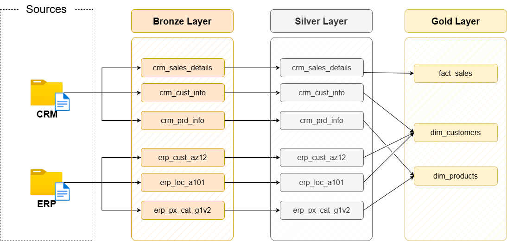
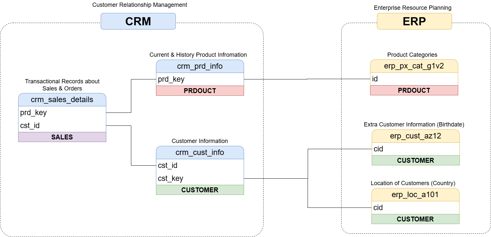
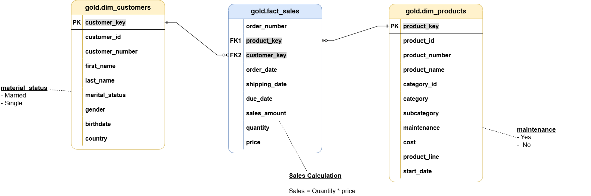

# SQL Data Warehouse Project

This is a guided learning project developed with **Microsoft SQL Server** to practise the main steps involved in building a data warehouse with SQL.

The project takes data from CRM and ERP CSV files, loads it into a database, cleans and combines the data, and creates a simple sales data mart using a star schema.

<p align="center">
  
</p>

## Learning Context

I completed this project while following the Udemy course [**Building a Modern Data Warehouse – Data Engineering Bootcamp**](https://www.udemy.com/course/building-a-modern-data-warehouse-data-engineering-bootcamp/).

The project structure, datasets, architecture, and general workflow are based on the course material. I implemented the SQL scripts locally, reviewed the transformations, performed the data quality checks, organized the repository, and documented the project as part of my learning process.

This repository is intended for **learning and portfolio purposes**.

## What I Practised

During this project, I worked with:

- SQL Server and T-SQL
- CSV data ingestion with `BULK INSERT`
- Stored procedures
- Full batch loads
- Data cleaning and standardization
- CRM and ERP data integration
- Window functions such as `ROW_NUMBER()` and `LEAD()`
- Dimensional modelling
- Star schemas
- Data quality checks
- Technical documentation

## Project Architecture

The project follows a simple **Bronze, Silver, and Gold** architecture:

| Layer | Purpose | Objects |
|---|---|---|
| **Bronze** | Stores the source data without transformations | Tables |
| **Silver** | Cleans and standardizes the source data | Tables |
| **Gold** | Combines the data into an analytical model | Views |

The source data comes from two systems:

- **CRM:** customers, products, and sales
- **ERP:** customer details, customer locations, and product categories

## Data Flow

<p align="center">
  
</p>

The flow of the project is:

1. CSV files are loaded into the Bronze tables.
2. A stored procedure transforms the Bronze data and inserts it into Silver.
3. Gold views combine the Silver tables into customer, product, and sales objects.
4. The final views can be used for SQL analysis or connected to a BI tool.

## ETL Process

### Bronze Layer

The Bronze layer stores the CSV data in its original structure.

The `bronze.load_bronze` stored procedure:

- Truncates the Bronze tables before each load.
- Loads the CSV files with `BULK INSERT`.
- Separates the CRM and ERP source tables.
- Measures the loading time for each table.
- Uses a full-load approach.

No data cleaning or business rules are applied in this layer.

### Silver Layer

The Silver layer cleans and standardizes the Bronze data before it is used for analysis.

Some of the transformations include:

- Removing duplicate customer records.
- Trimming unwanted spaces.
- Standardizing gender and marital-status values.
- Standardizing country codes.
- Removing prefixes and special characters from identifiers.
- Handling invalid or future dates.
- Replacing missing product costs.
- Converting product-line codes into readable values.
- Calculating product end dates with `LEAD()`.
- Correcting sales values when quantity, price, and total sales are inconsistent.

The main sales rule is:

```text
sales_amount = quantity × price
```

### Gold Layer

The Gold layer contains business-friendly SQL views organized as a star schema.

It includes:

- `gold.dim_customers`
- `gold.dim_products`
- `gold.fact_sales`

The customer and product views combine information from both CRM and ERP. The sales fact view connects each sales record with its corresponding customer and product.

## Data Integration

<p align="center">
  
</p>

The main relationships are:

- CRM sales are linked to CRM customers through the customer ID.
- CRM sales are linked to CRM products through the product key.
- ERP customer data adds birthdate and gender information.
- ERP location data adds the customer country.
- ERP category data adds product category, subcategory, and maintenance information.

## Gold Data Model

<p align="center">
  
</p>

The final model is a small sales data mart:

| View | Type | Description |
|---|---|---|
| `gold.dim_customers` | Dimension | Customer details enriched with ERP information |
| `gold.dim_products` | Dimension | Current product details enriched with categories |
| `gold.fact_sales` | Fact | Sales transactions linked to customers and products |

The product dimension only includes current products. Historical product records remain available in the Silver layer.

## Repository Structure

```text
sql-data-warehouse-project/
│
├── datasets/
│   ├── source_crm/
│   └── source_erp/
│
├── docs/
│   ├── ETL.png
│   ├── data_architecture.png
│   ├── data_flow.png
│   ├── data_integration.png
│   ├── data_model.png
│   ├── data_catalog.md
│   └── naming_conventions.md
│
├── scripts/
│   ├── init_database.sql
│   ├── bronze/
│   │   ├── ddl_bronze.sql
│   │   └── proc_load_bronze.sql
│   ├── silver/
│   │   ├── ddl_silver.sql
│   │   └── proc_load_silver.sql
│   └── gold/
│       └── ddl_gold.sql
│
└── tests/
    ├── quality_checks_silver.sql
    └── quality_checks_gold.sql
```

## How to Run the Project

### Requirements

- Microsoft SQL Server
- SQL Server Management Studio or another T-SQL client
- Permission to create databases, schemas, tables, stored procedures, and views

### Local file paths

This project was developed and executed using a **local SQL Server environment**. The `BULK INSERT` statements in `scripts/bronze/proc_load_bronze.sql` contain absolute paths to the CSV files.

Before running the Bronze load, replace those paths with the location of the `datasets` folder on your own computer. The SQL Server service must also have permission to read the files.

Example:

```sql
BULK INSERT bronze.crm_cust_info
FROM 'C:\path\to\sql-data-warehouse-project\datasets\source_crm\cust_info.csv'
WITH (
    FIRSTROW = 2,
    FIELDTERMINATOR = ',',
    TABLOCK
);
```

### Execution order

Run the scripts in this order:

1. `scripts/init_database.sql`
2. `scripts/bronze/ddl_bronze.sql`
3. `scripts/bronze/proc_load_bronze.sql`
4. Execute:

   ```sql
   EXEC bronze.load_bronze;
   ```

5. `scripts/silver/ddl_silver.sql`
6. `scripts/silver/proc_load_silver.sql`
7. Execute:

   ```sql
   EXEC silver.load_silver;
   ```

8. `scripts/gold/ddl_gold.sql`
9. `tests/quality_checks_silver.sql`
10. `tests/quality_checks_gold.sql`

After completing the load, the Gold views can be queried directly:

```sql
SELECT * FROM gold.dim_customers;
SELECT * FROM gold.dim_products;
SELECT * FROM gold.fact_sales;
```

> **Warning:** `scripts/init_database.sql` drops and recreates the `DataWarehouse` database if it already exists.

## Data Quality Checks

The project includes SQL scripts to check the quality of the Silver and Gold layers.

The checks cover areas such as:

- Duplicate or missing business keys
- Unwanted spaces
- Invalid dates
- Invalid product costs
- Standardized categorical values
- Incorrect sales calculations
- Duplicate surrogate keys
- Missing relationships between facts and dimensions

The validation queries should normally return no rows when the load has completed correctly.

## Educational Design Decisions

This is an educational project, so some decisions were kept simple:

- Bronze and Silver use full loads with `TRUNCATE` and `INSERT`.
- CSV paths are configured locally inside the Bronze procedure.
- Gold is implemented with views instead of physical fact and dimension tables.
- Surrogate keys are generated with `ROW_NUMBER()` inside the Gold views.

These choices make the project easier to understand and reproduce. In a production data warehouse, the same areas could be replaced with incremental loads, configuration tables, persistent surrogate keys, orchestration, logging, and automated deployment.

## Course Credit

This project follows the guided project from the Udemy course:

[**Building a Modern Data Warehouse – Data Engineering Bootcamp**](https://www.udemy.com/course/building-a-modern-data-warehouse-data-engineering-bootcamp/)

The original course materials, datasets, project concept, and architecture belong to their respective creator. This repository documents my implementation and learning process.

## Author

**Bernat Borras Cabot**
